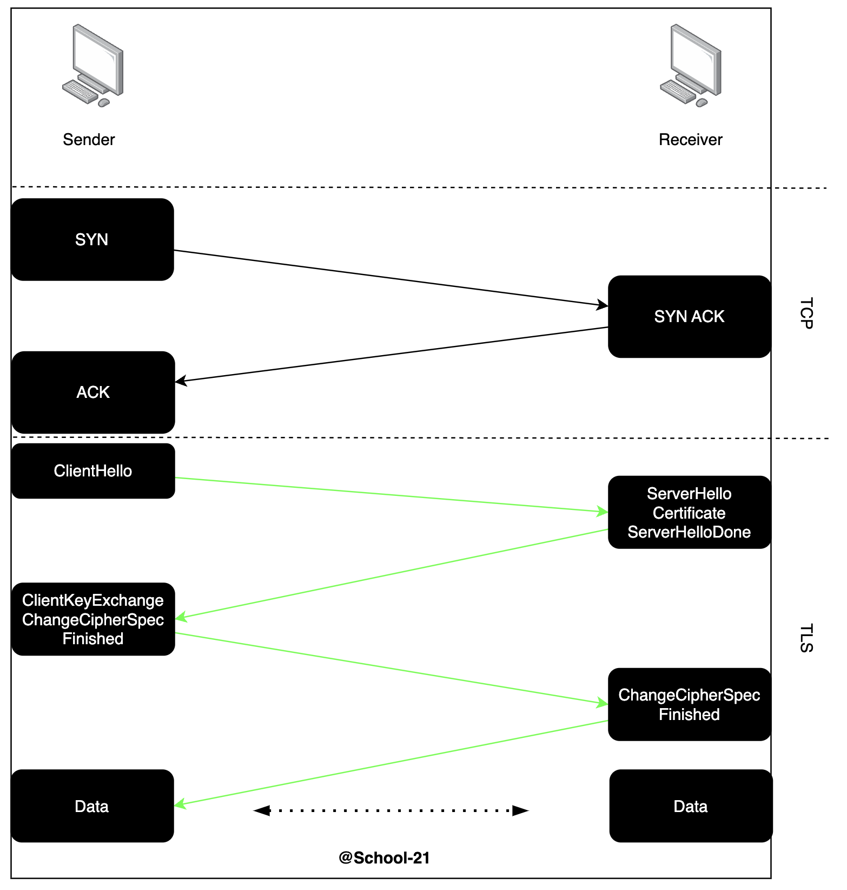

# Защита каналов связи — защита от ловушек

Аннотация: данный проект познакомит тебя с инструментами создания защищенных каналов связи. Ты настроишь веб-сервер с шифрованием протокола HTTP, SSL VPN соединение с шифрованием, а также научишься устанавливать КриптоПРО NGate и создавать с его помощью сертификаты с российскими алгоритмами шифрования.

## Содержание
1. [Chapter I](#chapter-i) \
   1.1. [Рекомендации к проекту](#рекомендации-к-проекту)
2. [Chapter II](#chapter-ii) \
   2.1. [Защита каналов связи](#защита-каналов-связи)
3. [Chapter III](#chapter-iii) \
   3.1. [Задание 1. SSL/TLS](#задание-1.-ssl/tls) \
   3.2. [Задание 2. SSL VPN](#задание-2.-ssl-vpn) \
   3.3. [Задание 3. КриптоПРО](#задание-3.-крипто-про) \
   3.4. [Задание 4. Дополнительное задание](#задание-4.-дополнительное-задание)
   

### Введение

>В далекой-далекой демократии жил гениальный пианист Криптховен. Его произведения пользовались популярностью у местной богемы, но до большой сцены он никак не мог добраться. Чтобы наконец пробить потолок карьерного роста, Криптховен решил записаться в оркестр при консерватории под руководством одиозного дирижера Шепарда. 
>
>Шепард никогда не брал кого-то со стороны, но решил дать молодому таланту шанс засветиться и стать вторым Луи Армстронгом.

## Chapter I
### Рекомендации к проекту
Как учиться в «Школе 21»:  
- На протяжении всего курса ты будешь самостоятельно добывать информацию. Пользуйся всеми доступными средствами поиска информации, к примеру, Google и GigaChat. Будь внимателен к источникам информации: проверяй, думай, анализируй, сравнивай. 
- Взаимообучение (P2P, Peer-to-Peer) — это процесс, при котором учащиеся обмениваются знаниями и опытом, выступая одновременно в роли учителей и учеников. Этот подход позволяет учиться не только у преподавателя, но и друг у друга, что способствует более глубокому пониманию материала.
- Не стесняйся просить помощи: вокруг тебя такие же пиры, которые тоже проходят этот путь впервые. Не бойся откликаться на просьбы о помощи. Твой опыт ценен и полезен, смело делись им с другими участниками. 
- Не списывай, а если пользуешься помощью — всегда разбирайся до конца, почему, как и зачем. Иначе твое обучение не будет иметь никакого смысла. 
- Если ты на чем-то застрял и кажется, что ты уже все перепробовал, но все равно непонятно, куда идти, — просто передохни! Поверь, этот совет помогал многим экспертам по КБ в их работе. Проветрись, перезагрузи голову, и, возможно, в следующий раз тебе наконец придет нужное решение!
- Важен не только результат обучения, но и сам процесс. Нужно не просто решить задачу, а понять, КАК ее решить.
- На пути к мастерству в сфере кибербезопасности ты получаешь возможность быть частью поддерживающего и вдохновляющего сообщества «Школы 21» по Кибербезопасности. Присоединяйся в [RocketChat](https://rocketchat-student.21-school.ru/channel/cybersec_21), чтобы получать свежие анонсы от сообщества,а также вступай в [Telegram](https://t.me/+r5wufz8L3mUzOGUy) для коммуникации.

Как работать с проектом: 
- Перед выполнением проект необходимо склонировать с GitLab в одноименный репозиторий.
- Все файлы с кодом необходимо создавать в папке src склонированного репозитория.
- После клонирования проекта необходимо создать ветку `develop` и вести разработку в ней. После этого пушить в GitLab также нужно ветку `develop`.
- В твоей директории не должно быть иных файлов, кроме тех, что обозначены в заданиях. 

Дисклеймер: 
- В целях геймификации обучения проект подается в формате истории, чтобы у тебя была возможность отвлечься от сложных заданий и тонны теории в гугле. Если придуманная история кажется тебе бесталанной и скучной, можно указать на это в обратной связи, чтобы автор поплакал над своим писательским навыком. Также можно пропускать введение в каждом задании и фокусироваться только на содержательной части.

## Chapter II
### Защита каналов связи

Защита каналов связи невозможна без криптографии. Конечно, вручную шифровать каждое сообщение, к счастью, не нужно. В основном задачу **«обеспечение защиты каналов связи»** можно перефразировать на **«поставить специальный софт / аппаратный комплекс и настроить его»**. Однако для того, чтобы настроить СКЗИ, необходимо понимать, что происходит «под капотом».

Итак, защищенный канал связи — это канал связи (проводной/беспроводной), который обеспечивает требуемый уровень конфиденциальности, целостности и доступности информации, т. е. ее защищенность. Формулировка «требуемый» может казаться расплывчатой, но на самом деле конкретный уровень защищенности обычно строго регламентирован в зависимости от организации/объекта защиты.

Чтобы стать экспертом защиты каналов связи, мало просто прочитать необходимую литературу (хотя и это тоже нужно, особенно нормативные документы). Как уже упоминалось, нужно уметь работать с различными СКЗИ на практике, а этому можно научиться только на различных сертификациях или воркшопах.

Литература для ознакомления:

- **Методы и средства криптографической защиты информации.**

Сертификации (исключительно отечественное ПО):

- **Администрирование системы защиты информации ViPNet;**
- **Программно-аппаратные комплексы ViPNet;**
- и другие (на тему администрирования и принципов работы различных СКЗИ).

## Chapter III
### Задание 1. SSL/TLS

Для решения данного задания нужны знания в следующих темах: handshake, SSL/TLS, nginx, Wireshark, протоколы транспортного уровня OSI.

>В оркестре было непросто. Таких же талантливых, как Криптховен, была половина всей группы, поэтому приходилось работать днями и ночами, чтобы стать основным джазовым пианистом и попасть на выступление. 
>
>Перед одним из концертов ему выпал такой шанс.
>
>Основное фортепиано группы забыл партитуру, а времени возвращаться домой не было. Поэтому Шепард решил поставить запасного пианиста в основу — этим запасным вариантом был Криптховен. После недолгого спора решение было принято. Шепард не любил выскочек, но еще больше он не любил балбесов, которые забывают ноты. Поэтому уже на следующий день после успешного концерта Криптховен был в основе. 
>
>Никто так никогда и не узнал, что тот несчастный не потерял партитуру — это Криптховен подложил ноты в другую папку, чтобы основной пианист ее не нашел.

Типичный пример защищенного канала связи — банальное клиент-серверное шифрование соединения с помощью SSL/TLS. Данный канал связи формируется после SSL/TLS handshake — обмена данными и сертификатами между сервером и клиентом.

Название SSL/TLS произошло не случайно: в рамках зашифрованного соединения используются SSL-сертификаты, но сам протокол называется TLS (Transport Layer Security). Эту историческую справку нужно учитывать, поскольку в литературе можно встретить как TLS handshake, так и SSL/TLS handshake.

Процесс установления защищенного соединения включает в себя этапы аутентификации и обмена сертификатами. При этом используются как асимметричные, так и симметричные алгоритмы шифрования, но на разных этапах. Ознакомиться с последовательностью установления защищенного соединения можно на картинке:



Более детально с протоколом TLS последней версии (на данный момент 1.3) можно ознакомиться, как и с любым другим протоколом, в соответствующей RFC:

https://datatracker.ietf.org/doc/html/rfc8446

**Твое задание**: создай защищенный канал связи для HTTP-сервера и клиента. Для этого выполни следующие действия: 
1. Установи nginx на виртуальной машине со стандартной страницей приветствия и настрой его на работу по HTTPS. 
2. Включи захват Wireshark и на этой же виртуальной машине открой в браузере страницу приветствия nginx (страница должна быть открыта по протоколу HTTPS, 443-й порт по умолчанию). 
3. Сохрани захваченный трафик из Wireshark в файл с названием `my_tls_connection.pcap`. А затем вырежи все, кроме пакетов между твоим клиентом и веб-сервером. Обрезанную версию pcap залей на гит под названием `my_website.pcapng`.


### Задание 2. SSL VPN

Для решения данного задания нужны знания в следующих темах: OpenVPN, SSL, канальный уровень модели OSI, технология VPN.

>Сложнейший график репетиций, рыдания в подушку — все это стало частью жизни Криптховена. Неудивительно, что через время он сломался и бросил музыку. На заработанные с концертов гонорары он вел спокойную жизнь, периодически посещал джаз-кафе и планировал заняться продюсированием молодых музыкантов.
>
>Но один вечер в джаз-клубе перевернул его жизнь на 180 градусов. 
>
>Это было проходное выступление местной группы, поэтому Криптховен слушал вполоборота, но внезапно обнаружил Шепарда, сидящего напротив. Молодой человек попытался сделать вид, что не видит своего бывшего дирижера, но от цепкого взгляда профессионала не спрятаться — он подсел к Криптховену и начал разговор.
>
> — Наверное, ты слышал... Я больше не в оркестре.
>
> — Да, я слышал про это... Сами ушли?
>
> — Да не совсем. Кого-то из студентов подговорили что-то сказать обо мне. Хотя что обо мне можно сказать, кроме дифирамбов? Не понимаю, ей-богу.
>
>Криптховен рассмеялся.
>
> — Дирижирую немного. Вот фестиваль JVC вернули снова. Зовут на открытие с профессиональным оркестром... Честно, думаю, ни до кого не дошло, что я пытался сделать в консерватории. Я там не дирижировал. Любой дурак может махать руками и держать темп. Я хотел, чтобы вы преодолели пределы ожидаемого. Думаю, что это абсолютно необходимо, иначе мы лишим мир нового Чарли Паркера, нового Луи Армстронга.
>
> — Да, но неужели обучение не может быть комфортным? Чтобы никто не чувствовал себя недостаточно хорошим? — сказал Криптховен с намеком.
>
> — С каждым альбомом джаза из Старбакса я убеждаюсь все больше, что нет в нашем языке слова вреднее и опаснее, чем «молодец».
>
> — А где же грань? Может, вы перестараетесь, и новый Чарли Паркер сломается и никогда не станет Чарли Паркером?
>
> — Нет, что ты, настоящий Чарли Паркер ни-ко-гда не сломается.

Как понятно из названия, SSL VPN базируется на протоколе SSL, а значит, использует сертификаты и ключи для организации защищенного канала. На практике SSL VPN применяется достаточно часто, поскольку может работать без отдельного клиента (их еще называют Clientless SSL VPN) — доступ можно организовать из браузера или с телефона, в отличие от, например, IPSEC VPN. Поэтому доступ к ресурсам компании, таким как веб-сервисы, почта, различные порталы, осуществляются чаще всего именно через SSL VPN.

В компаниях для организации чаще всего используют специальное ПО, например, Cisco AnyConnect.

Сам процесс создания защищенного VPN туннеля очень схож с обычным шифрованием SSL/TLS. Точно так же происходит рукопожатие, обмен ключами (с использованием асимметричного шифрования), а затем создается зашифрованный канал (в котором шифрование осуществляется уже с использованием алгоритмов симметричного шифрования). Весь процесс можно описать по шагам:

- Ты запускаешь клиента (например, веб-браузер или отдельный клиент, как в случае с OpenVPN), который инициирует соединение с сервером.
- Сервер посылает тебе свой сертификат, который содержит открытый ключ.
- Твой клиент проверяет сертификат, чтобы убедиться, что он действителен и принадлежит правильному серверу.
- Далее клиент генерирует случайный секретный ключ и шифрует его открытым ключом сервера, после чего посылает на сервер.
- Сервер расшифровывает этот ключ с использованием своего закрытого ключа.
- Теперь клиент и сервер оба имеют одинаковый секретный ключ и начинают использовать его для симметричного шифрования всех данных.
- Все пакеты данных, передаваемые между клиентом и сервером, шифруются этим секретным ключом. Если кто-то перехватит эти пакеты, они будут зашифрованы и не могут быть прочитаны без ключа.
- Для обеспечения целостности данных может использоваться HMAC (hash-based message authentication code), чтобы гарантировать, что данные не были изменены в процессе передачи.

Самое время попробовать себя в роли удаленщика!

**Твое задание**: с помощью OpenVPN подними сервер SSL VPN и организуй подключение с помощью клиента OpenVPN (задание выполняется локально на одной виртуальной машине).

1. Создай на виртуальной машине Linux сервер OpenVPN с использованием DH-параметров для TLS handshake.

    Названия следующие: 
    - сертификат CA — **ca.crt**, 
    - сертификат сервера — **server.crt**, 
    - ключ сервера — **server.key**, 
    - DH-файл — **dh.pem**, 
    - конфигурационный файл сервера — **server.conf**.

    В качестве организации для сертификатов укажи «School-21», а в качестве юнита (OU) укажи «cryptoProf».

2. После настройки сервера запусти его и убедись, что он работает.

3. Создай и настрой конфигурацию для пользователя (клиента OpenVPN). В организации и юните укажи те же параметры, что и для сервера.

4. Подключись к работающему OpenVPN серверу с помощью клиента OpenVPN. Подключение должно пройти успешно.

5. Загрузи в папку server на гите следующие файлы:
    - `ca.crt` (сертификат удостоверяющего центра),
    - `server.crt` (сертификат сервера),
    - `server.key` (ключ сервера),
    - `dh.pem` (файл с параметрами Diffie-Hellman),
    - `server.conf` (конфигурационный файл сервера).
    
    А в папку client следующие:
    - `ca.crt` (сертификат удостоверяющего центра),
    - `client.crt` (сертификат клиента),
    - `client.key` (ключ клиента),
    - `client.ovpn` (конфигурационный файл клиента).

### Задание 3. КриптоПро

Для решения данного задания нужны знания в следующих темах: КриптоПРО Ngate, асимметричное и симметричное шифрование, средства виртуализации.

>Прямо перед выходом из кафе Шепард окликнул Криптховена.
>
>— Малец, у меня в оркестре завтра пианист не тянет, может, встанешь в основу вместо него? Репертуар ты знаешь.
>
>Криптховен задумался, но ответ он знал с первой секунды:
>
>— Да, конечно! Во сколько приходить?
>
>Сцена, весь оркестр уже на местах. Свет ослепляет, а зрители с замиранием ждут феерии. Криптховен надел свой лучший костюм, а всю ночь вспоминал свои партии — он был готов на сто процентов.
>
>Подойдя к роялю и помпезно откинув фрак, Криптховен в ужасе обнаружил, что ноты на пюпитре ему незнакомы! В этот момент на сцену вышел Шепард и объявил название композиции — она была абсолютно не из репертуара молодого пианиста. Осмотревшись, Криптховен понял, что весь оркестр уже приготовился, а значит, Шепард не ошибся — это была ловушка.
>
>Взмах руками, и музыка началась. За исключением партии фортепиано — Криптховен пытался подстроиться по слуху, но получалось скверно, больше было похоже на первый класс музыкальной школы, чем на концерт профессионалов.
>
>После первой композиции все зрители были в недоумении, а Шепард с упоением наблюдал за величайшим провалом Криптховена.
>
>— Чарли Паркер никогда не сломается, говоришь? — подумал про себя пианист, скидывая фрак на пол, и, не дожидаясь объявления Шепарда, начал играть самое лучшее свое соло, которое придумал сам. Его пальцы бегали, как будто ожили. 
>
>Как ни странно, Шепард не стал останавливать его, а постепенно начал подключать скрипку и бас, которые подстроились под ритм и тональность. В конце выступления зал аплодировал стоя. Занавес.

Помимо open source VPN-серверов, существуют уже готовые аппаратные платформы, которые позволяют настраивать различные варианты защищенных каналов «из коробки». Это, по сути, маршрутизаторы на базе специальных операционных систем на базе ядра Linux, в которые заранее вшиты необходимые драйвера, пакеты и софт для шифрования, создания сертификатов/ключей, балансировки нагрузки и т. д. 

В силу происходящего перехода на отечественное ПО, а также с учетом отечественных алгоритмов шифрования, зачастую необходимо интегрировать российские решения с зарубежными, чтобы обеспечить достаточную криптографическую устойчивость защищенных каналов в соответствии с требованиями регуляторов и нормативных актов.

Одним из популярных решений на рынке РФ является КриптоПРО NGate. Это аппаратная платформа с одноименным ПО, которые позволяют создавать и настраивать защищенные VPN-подключения с российскими алгоритмами шифрования.

Чтобы выполнить практическое задание, необходимо скачать установочный образ NGate и установить его на новую виртуальную машину.

https://cryptopro.ru/products/ngate

На сайте необходимо выбрать «скачать демо», после чего зарегистрироваться и скачать дистрибутив Complete в соответствии с архитектурой вашего процессора.

**Твое задание**: напутствие перед началом: тебе понадобится флешка, приготовь ее заранее. А также приготовь пальцы, поскольку генерация внешней гаммы тебе очень понравится.

1. Установи NGate на виртуальную машину в соответствии с инструкцией (необходимо выполнить все до шага 15 включительно):

    https://cpdn.cryptopro.ru/content/ngate/admin-guide/source/13-setting-examples/task-display-stand-creation.html

    ``Примечание: верификацию installation media можно не проводить.``

    ```Важно: при создании сертификатов в OU впиши MCPeer. Экспортируй через расшаренную папку / флешку сертификаты root.cer и admin.cer, а также контейнер закрытого ключа администратора. Остальное оставляй как в инструкции.```

    **Важно v.2: если на шаге 14(d) у тебя отсутствует клавиша Create certificate bindings, то нажимай Activate superadmin portal.**

    **Важно v.3: если сертификат сервера не создается, попробуй убедиться, что DNS name в системе выставлен и совпадает с вводимым в сертификате. Кроме того, может помочь перезапуск устройства и затем новая генерация внешней гаммы.**

2. После 15 шага собери все файлы:

    - root.cer,
    - admin.cer,
    - контейнер закрытого ключа администратора (mcradmin.000).

    И залей их на гит. Дальнейшее подключение АРМ Администратора к NGate в рамках основных заданий не требуется.


### Задание 4. Дополнительное задание

Для дополнительного задания тебе потребуется дополнительная виртуальная машина с ОС Windows 10 (Home/Pro). Необходимо установить на нее КриптоПРО CSP, триальную версию. Сделать это можно по следующей ссылке:

https://www.cryptopro.ru/products/csp

**Твое задание**:

1. Выполни настройку связи между АРМ Администратора и СУ. Для этого до конца следуй всем шагам из документации из Задания 3:

    https://cpdn.cryptopro.ru/content/ngate/admin-guide/source/13-setting-examples/task-display-stand-creation.html

2. Сделай скриншот экрана, на котором видно установленный сертификат администратора и его детали.
3. Сделай скриншот из контрольной панели Ngate, открытой в браузере. Необходимо, чтобы было видно адресную строку и сам интерфейс.
4. Оба скриншота загрузи на гит с названиями `admin_cert.png` и `control_panel.png`.

---

💡 Нажми [сюда](https://new.oprosso.net/p/4cb31ec3f47a4596bc758ea1861fb624), чтобы поделиться с нами обратной связью на этот проект. Это анонимно и поможет команде Продукта сделать твое обучение лучше.
