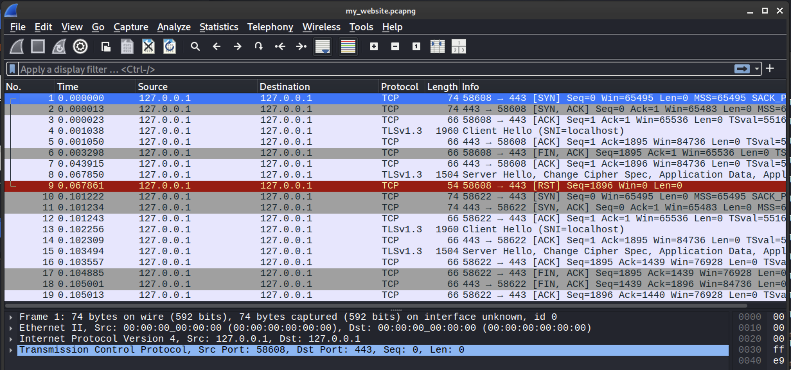
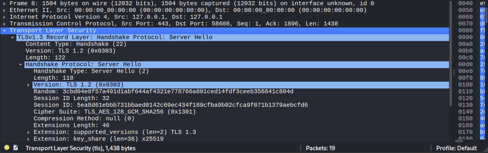
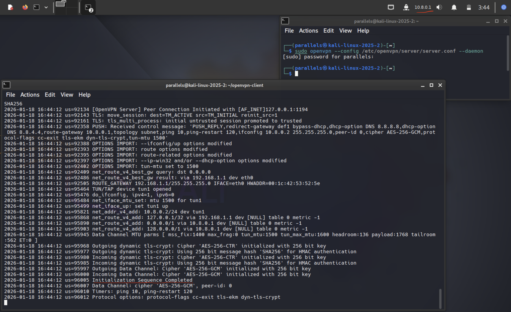
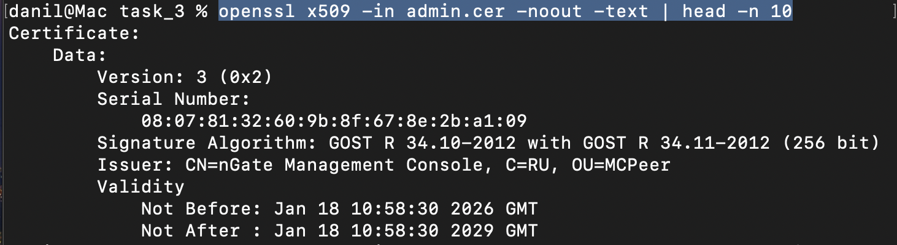
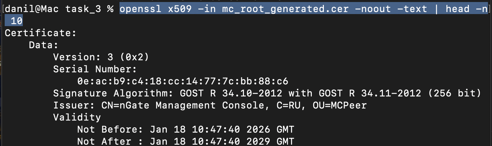
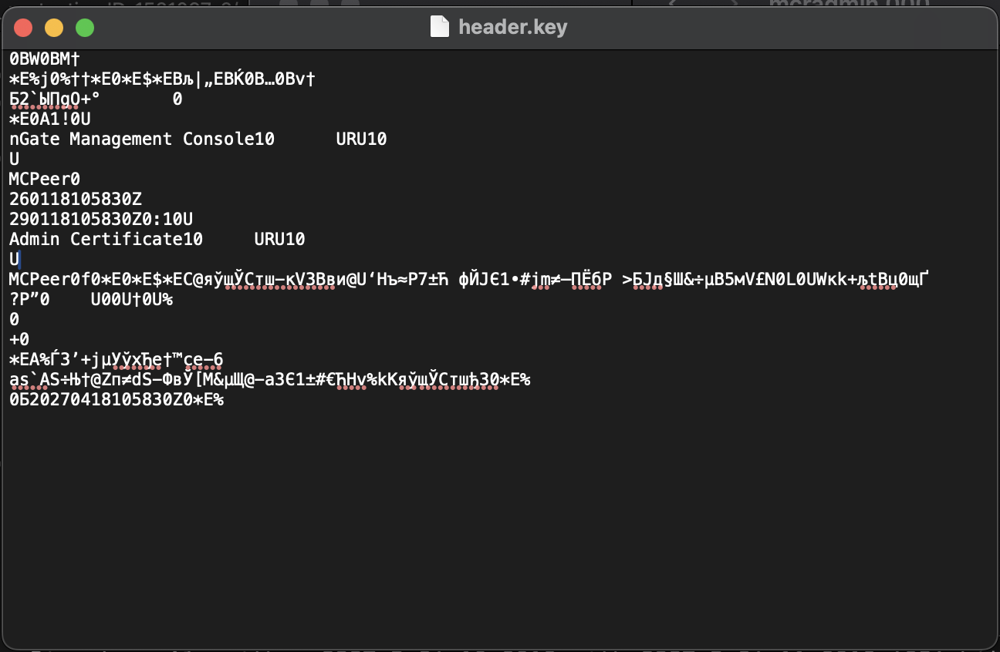
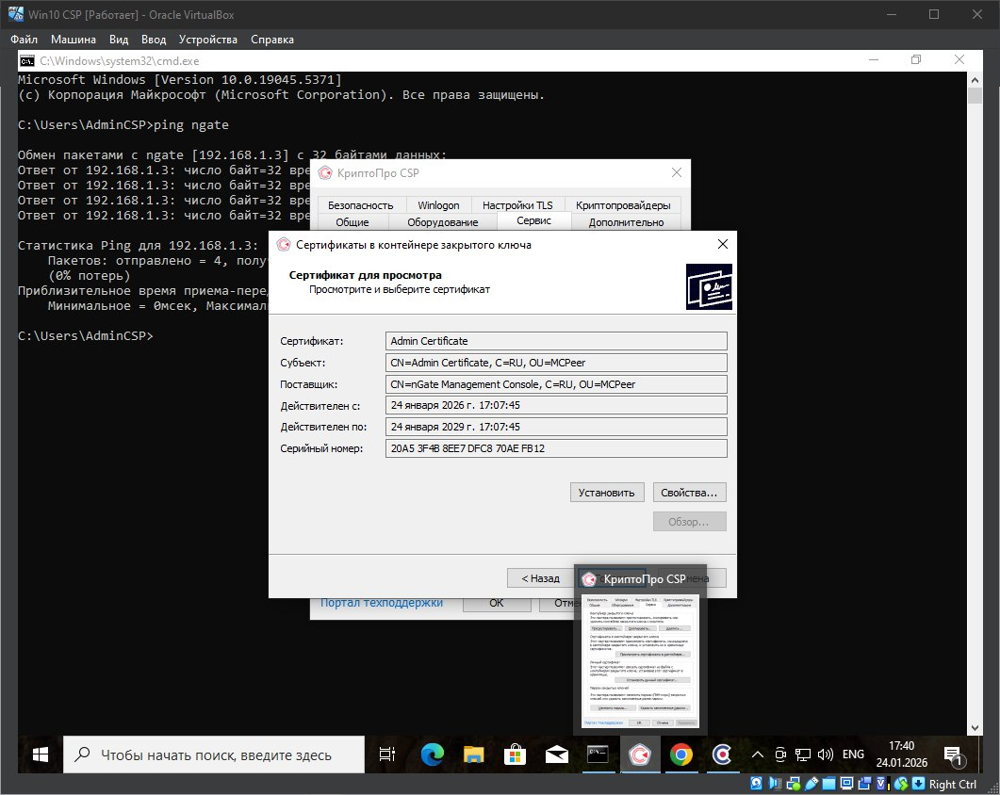
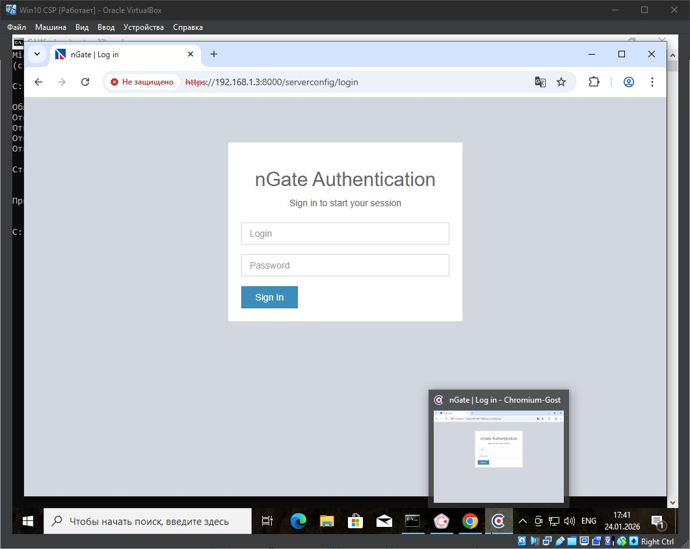

# Защита каналов связи — защита от ловушек

## Содержание
   1. [Задание 1. SSL/TLS](#задание-1-ssl/tls) 
   2. [Задание 2. SSL VPN](#задание-2-ssl-vpn) 
   3. [Задание 3. КриптоПРО](#задание-3-крипто-про) 
   4. [Задание 4. Дополнительное задание](#задание-4-дополнительное-задание)

---

### Задание 1. SSL/TLS
> **Твое задание:** создай защищенный канал связи для HTTP-сервера и клиента.

В task_1/my_website.pcapng лежит дамп с нужными пакетами:



---

### Задание 2. Ssl vpn
> **Твое задание:** с помощью OpenVPN подними сервер SSL VPN и организуй подключение с помощью клиента OpenVPN (задание выполняется локально на одной виртуальной машине).

Создал нужные ключи и прописал по ним конфиги (server.conf и client.conf): ```task_2/server/server.conf``` и ```task_2/client/client.conf```.

Сначала запускаю сервер конф серез ```sudo openvpn --config server.conf --daemon```, затем в новом терминале запускаю клиента ```sudo openvpn --config client.conf --verb 4``` и в выводе вижу Initial sequence complete:


---

### Задание 3. Крипто про
> **Твое задание:** Установить и настроить CryptoPro NGate ( Минимальный стенд) После 15 шага собери все файлы:
* root.cer,
* admin.cer,
* контейнер закрытого ключа администратора (mcradmin.000).

Собрал необходимые сертификаты, проверил через консоль:
* ```openssl x509 -in admin.cer -noout -text | head -n 10```:


* ```openssl x509 -in mc_root_generated.cer -noout -text | head -n 10```:


* И в файле ```header.key``` среди видны данные ключа:


---

### Задание 4. Дополнительное задание
> **Твое задание:** Выполни настройку связи между АРМ Администратора и СУ. 
* Cделай скриншот экрана, на котором видно установленный сертификат администратора и его детали.
* Сделай скриншот из контрольной панели Ngate, открытой в браузере. Необходимо, чтобы было видно адресную строку и сам интерфейс.
Оба скриншота загрузи на гит с названиями admin_cert.png и control_panel.png.


Cкриншот экрана, на котором видно установленный сертификат администратора и его детали:


Скриншот из контрольной панели Ngate, открытой в браузере. Необходимо, чтобы было видно адресную строку и сам интерфейс:

